# Advanced Programming - Lab 3

This repository contains all the problems proposed for the third laboratory in Advanced Programming course
solved by me.

## Essential tools

You need to have Java RE or JDK >= 8 installed on your computer.

## How to run it?

1. Open project with IntelliJ IDEA

Clone this repository and open it with IntelliJ IDEA. Build this project
(shortcut Ctrl+F9) then go to Run->Run...(shortcut Alt+Shift+F10) and select
the file you want to run.

2. Compile and run the programs using CMD

Go to the folder where the file is located. Open a new terminal here.

If you want to compile the file Main.java you must type the command.

```bash
javac -d . Main.java
```

After you compiled it, if you want to start the program you can type the
following command

```bash
java packageName.Main
```

where to packageName is the name of the package which includes the file Main.java.

## Problem

### The Tourist Trip Planning Problem
A tourist is about to visit a city. In this city, there are various locations such as tourism sites, hotels and restaurants, parks, etc. Locations have names and may have other common properties (such as a description, an image, coordinates, etc). Depending on its type, each location has various specific properties. However, if the location is a visitable, it must have opening hours. If the location is payable, it must have the entry fee (the price of the ticket). If the location is classifiable, it must have a classification (a rank).

The time (in minutes) required to go from one location to another is known. The tourist has also preferences regarding the order in which he (or she) would like to visit some locations.

Example: locations are: v1 (Hotel) v2 (Museum A) v3 (Museum B) v4 (Church A) v5 (Church B) v6 (Restaurant).


## Tasks

### Compulsory

- [x] Create an object-oriented model of the problem. You should have at least the following classes City, Hotel, Museum, Church, Restaurant. The natural ordering of their objects is given by their names.
- [x] Create the interfaces Visitable, Payable, Classifiable. The classes above must implement these interfaces accordingly.
- [x] The City class will contain a List of locations.
- [x] Each location will contain a Map representing the times required to go from this location to others.
- [x] Create all the objects given in the example.

### Optional

- [x] In the City class, create a method to display the locations that are visitable and are not payable, sorted by their opening hour.
- [x] Create default methods in the interface Visitable, with the opening hour 09:30 and the closing hour 20:00.
- [x] Create a static method getVisitingDuration,in the interface Visitable, that returns a Duration object, representing how long a location is opened during a day.
- [x] Create the class TravelPlan. An instance of this class will contain a city and the preferences regarding the visiting order.
- [x] Implement an efficient algorithm to determine the shortest path between two given locations, conforming to the preferences.

#### Example 1

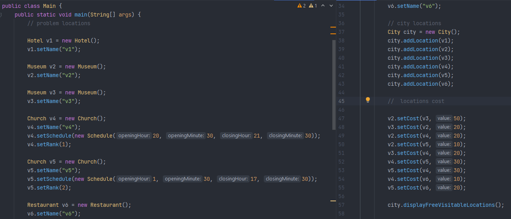
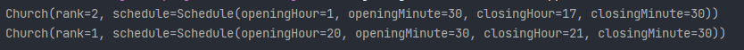

#### Example 2

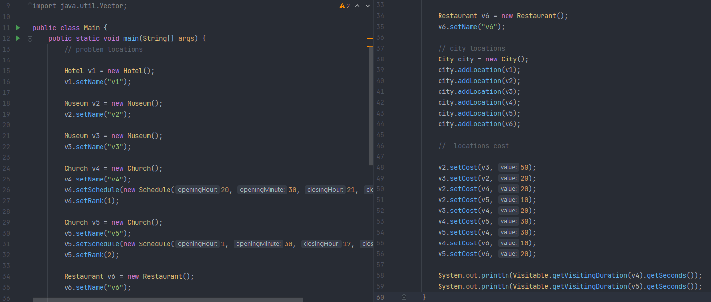
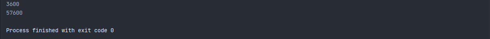


#### Example 3

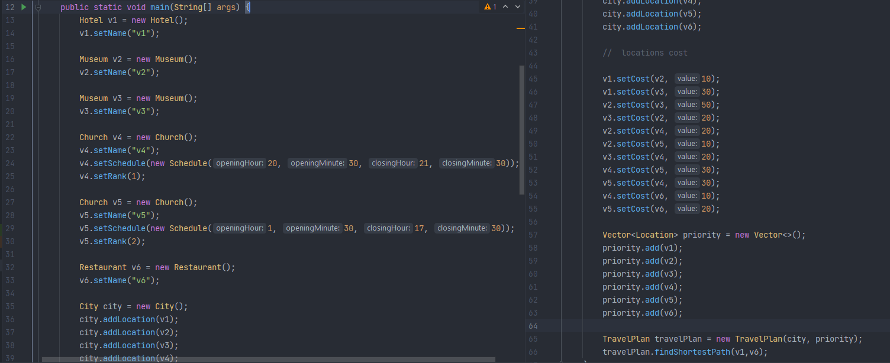
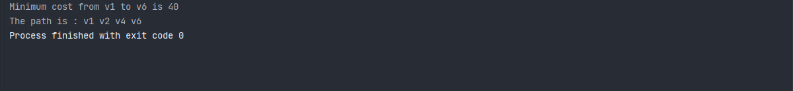

The graph for the instance of the problem is:
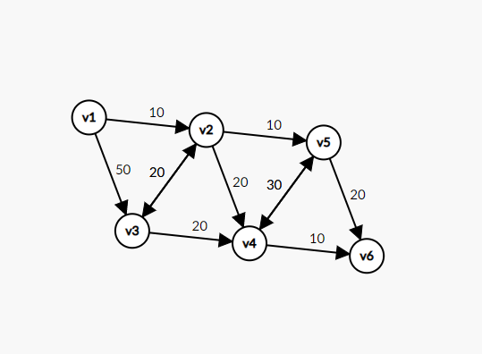

And the priority of the locations is : v1, v2, v3, v4, v5, v6.

#### Example 4

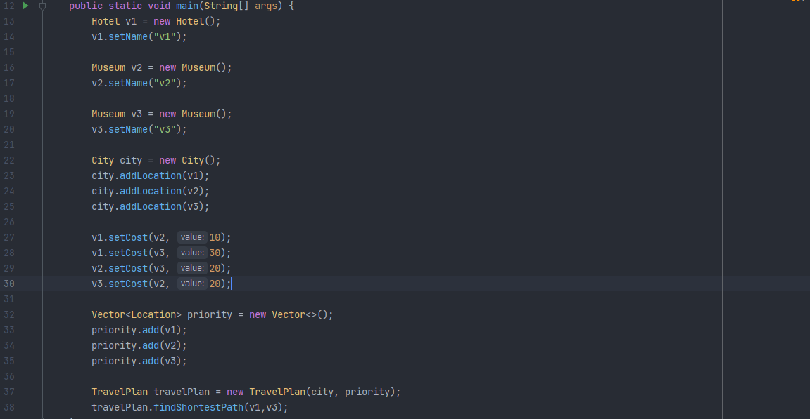
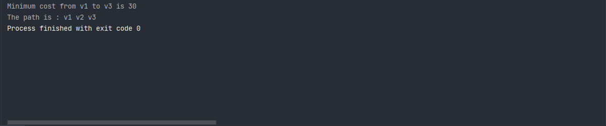

The graph for the instance of the problem is:
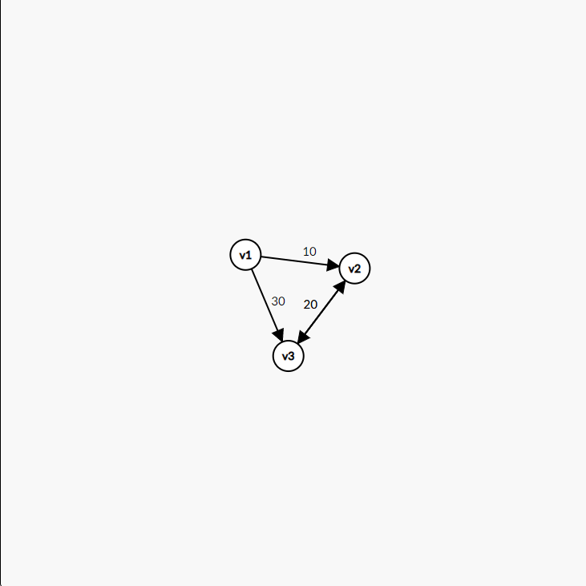

And the priority of the locations is : v1, v2, v3.

#### Example 5 

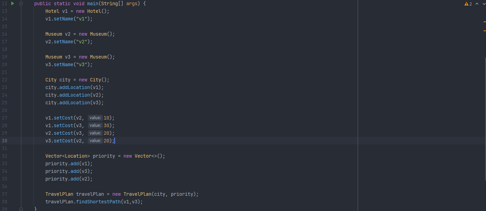
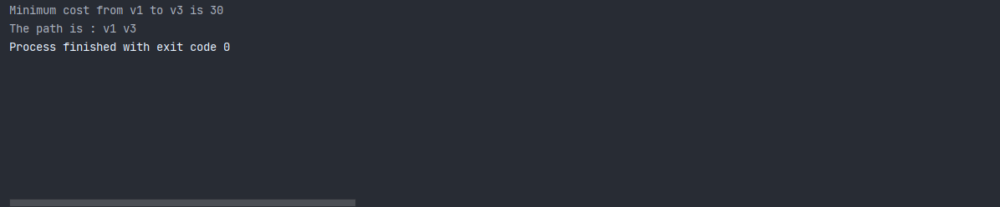

Same instance of the city but different priorities(v1,v3,v2).

### Bonus

- [ ] Suppose that the tourist has a specific number of days available to visit the city and every day he (or she) has the same number of minutes available for visiting.
- [ ] Suppose that there is a special start location (the hotel) - the tourist must start and end a daily trip in this location.
- [ ] Implement an algorithm that will create a plan (a trip for each day), such that the tourist visits as many locations as possible.
- [ ] Test your algorithm using JUnit or other framework.

